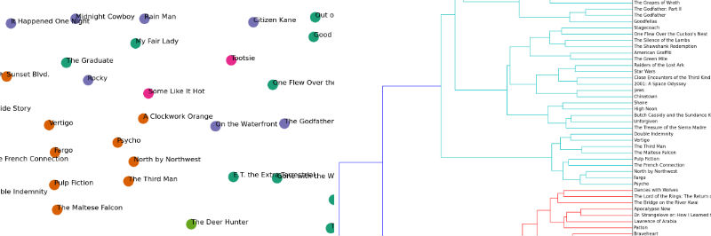

# Document Clustering with Python

In this guide, I will explain how to cluster a set of documents using Python. My motivating example is to identify the latent structures within the synopses of the top 100 films of all time \(per an IMDB list\). See [the original post](http://www.brandonrose.org/top100)for a more detailed discussion on the example. This guide covers:

*  tokenizing and stemming each synopsis
*  transforming the corpus into vector space using [tf-idf](http://en.wikipedia.org/wiki/Tf%E2%80%93idf)
*  calculating cosine distance between each document as a measure of similarity
*  clustering the documents using the [k-means algorithm](http://en.wikipedia.org/wiki/K-means_clustering)
*  using [multidimensional scaling](http://en.wikipedia.org/wiki/Multidimensional_scaling) to reduce dimensionality within the corpus
*  plotting the clustering output using [matplotlib](http://matplotlib.org/) and [mpld3](http://mpld3.github.io/)
*  conducting a hierarchical clustering on the corpus using [Ward clustering](http://en.wikipedia.org/wiki/Ward%27s_method)
*  plotting a Ward dendrogram
*  topic modeling using [Latent Dirichlet Allocation \(LDA\)](http://en.wikipedia.org/wiki/Latent_Dirichlet_allocation)

The 'cluster\_analysis' workbook is fully functional; the 'cluster\_analysis\_web' workbook has been trimmed down for the purpose of creating this walkthrough. Feel free to download the repo and use 'cluster\_analysis' to step through the guide yourself.

## How the repo is set up

Once you've pulled down the repo, all you need to do is run 'cluster\_analysis.ipynb'; it will find the various lists of synopses and titles. The 'Film\_Scrape.ipynb' contains the code I used to actually scrape the synopses, in case you are interested. The other items in the repo are mostly incidentals for setting up the webpage walk-through. There is also one pickled model.

At some point in the future I'll write up how I executed the web scraping in case it's of interest.

